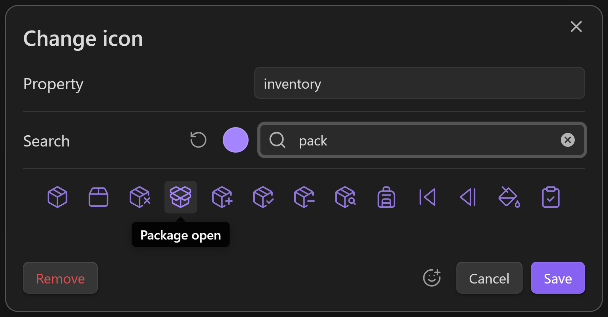

# Iconic

A plugin for iconophiles, designed to blend seamlessly with vanilla Obsidian.

Click almost any icon on a tab, list, or ribbon to swap in one of the 1,300+ icons included in the app, or one of the 1,900+ emojis that your device can display.

> ⤿ Themes: [Obsidian gruvbox](https://github.com/insanum/obsidian_gruvbox), [Catppuccin](https://github.com/catppuccin/obsidian), [Everforest Enchanted](https://github.com/FireIsGood/obsidian-everforest-enchanted)

Includes language support for English, Arabic, German, Spanish, French, Indonesian, Japanese, Russian, and Simplified Chinese.
Most of the menus are currently machine-translated, but if you can supply more accurate translations, absolutely send a message or a pull request :)

## Supported items

- Tabs
- Files & Folders
- Bookmarks & Groups
- Properties
- Ribbon commands
- Sidebar toggles
- Help & Settings buttons
- (Tablets) Pin buttons

## How to install

This is still a *very* new plugin, so it's not searchable inside Obsidian yet. Follow these steps to install it using the BRAT plugin:

1. Open Obsidian
2. Search for **BRAT** in the community plugins browser, then install and enable it
3. In the settings for BRAT, click the **Add Beta Plugin** button
4. Paste this link `https://github.com/gfxholo/iconic` and click **Add Plugin**

If you don't want to use BRAT, you can also download the [latest release files](https://github.com/gfxholo/iconic/releases) (ignore the source code) and drop them inside `.obsidian/plugins/iconic/`.

## How to use

Secondary-click an item whose icon you want to change, then click **Change icon** from the menu. You can open menus on mobile by pressing & holding an item. Certain lists like Files, Bookmarks, and Properties let you hold <kbd>Shift</kbd> to select several items at once.

Every icon and emoji is searchable by name. When you find one that sings for you, click on it to confirm. Toggle the emoji picker by clicking the smiley button.

You can choose one of nine basic colors per icon. These colors follow the CSS theme of your vault, so they adjust automatically when it changes. You can also choose a specific RGB color instead.

## How is this plugin different from [Iconize](https://github.com/FlorianWoelki/obsidian-iconize)?

Both plugins can add icons to files, folders, and bookmarks. *Iconic* can also:

- Set icons for plugin tabs, properties, the ribbon, and some other UI buttons
- Edit icons by clicking them
- Change icons & colors in the same dialog
- Dynamically change colors with the theme

*Iconize* is much more powerful at decorating files. It can:

- Download and import icon packs
- Use Twitter-style emojis
- Type icons directly into your notes
- Show icons beside links
- Show icons beside note titles
- Obey `icon` and `iconColor` properties
- Auto-set icons based on filename rules
- Customize icon size & margins

### Can I use both plugins together?

Yes, just expect a few visual bugs! They currently do some fighting over control of tab icons and the Bookmarks pane.

## License

This plugin is released under an [MIT No Attribution](https://choosealicense.com/licenses/mit-0/) license, which means you're free to modify and share its source code without even mentioning the author (me). It also protects the author from liability for damages, so I recommend using a similar license if you republish this code.
