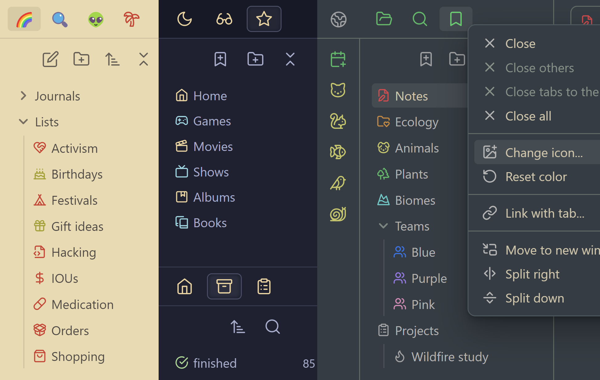
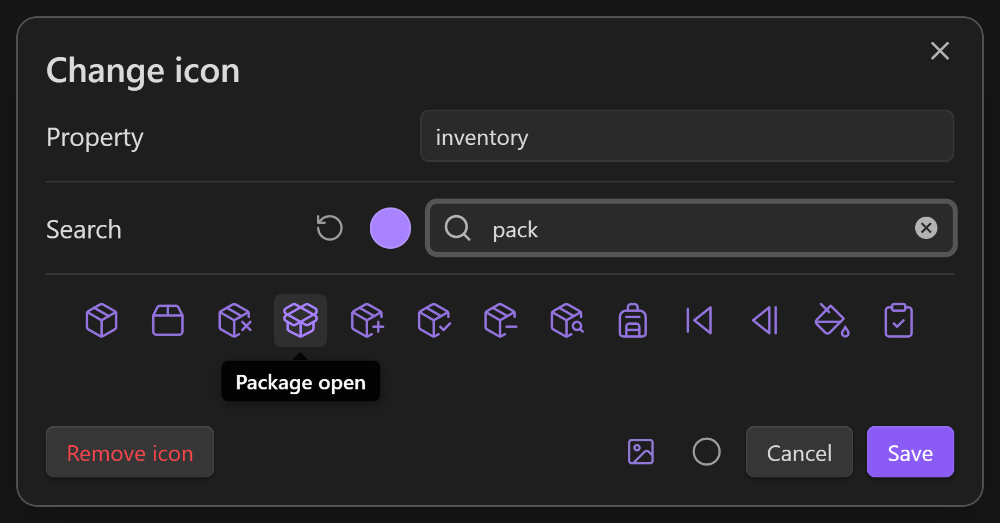
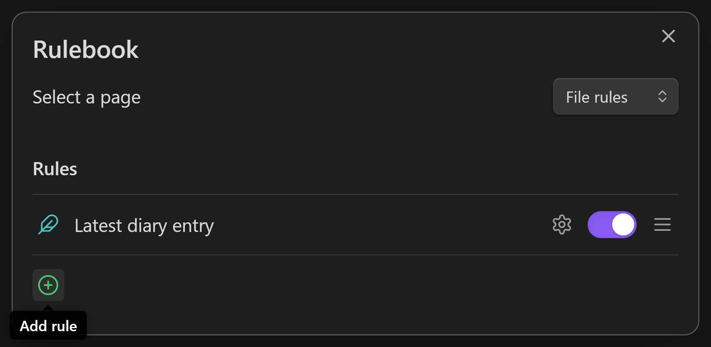
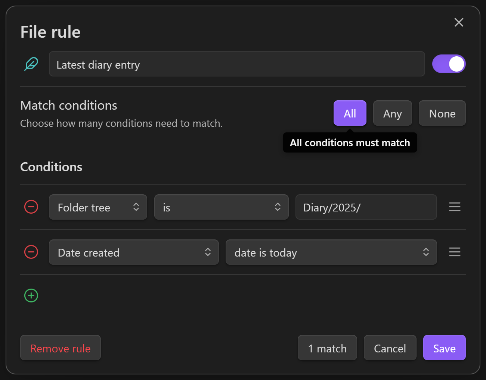

# Iconic

A plugin for iconophiles, designed to blend seamlessly with vanilla Obsidian.

Click almost any icon on a tab, sidebar, ribbon, or title bar to swap in one of the 1,700+ icons included in the app, or one of the 1,900+ emojis that your device supports.

> ⤿ Themes: [Ayu Light & Mirage](https://github.com/taronull/ayu-obsidian) / [Fancy-a-Story](https://github.com/ElsaTam/obsidian-fancy-a-story) / [Primary](https://github.com/primary-theme/obsidian)

Includes language support for English, Arabic, German, Spanish, French, Indonesian, Japanese, Russian, Ukrainian, and Simplified Chinese. Most of these languages are currently machine-translated, but if you can supply more accurate translations, absolutely send a message or a pull request :)

## Supported items

- Tabs 📑
- Files & Folders 📝📂
- Bookmarks & Groups 🔖📂
- Tags 🏷️
- Properties 📦
- Ribbon commands 🎀
- Minimize/Maximize/Close buttons 🪟
- Sidebar toggles ◀️▶️
- Help/Settings buttons ❔⚙️
- Pin buttons (on tablets) 📌

## How to use

### Changing an icon

Secondary-click an item whose icon you want to change, then click **Change icon** from the menu. You can open menus on mobile by pressing & holding an item. Certain lists like Files, Bookmarks, and Properties let you hold <kbd>Alt</kbd> or <kbd>⇧ Shift</kbd> to select multiple items at once.

Every icon is searchable by name. You can filter between icons and/or emojis by clicking the bottom two toggles. When you find an icon that sings for you, click it to confirm.

You can also choose one of nine optional colors per icon. These colors follow the CSS theme of your vault, so they adjust automatically when it changes. If you prefer a specific RGB color, secondary-click the bubble to open the full color picker.

### Setting up rules

You can automate your file & folder icons based on a variety of conditions, like their name, their extension, their parent folder, their tags, their property values, the date you've created or modified them, and even the current time of day. Automated icons never remove your custom icons — only replace them visually — so you can be as experimental as you want.

Open the rulebook from the ribbon, from the plugin settings, or by using the **Open rulebook** command. There are currently two pages in the rulebook: **File rules** and **Folder rules**, which affect files and folders respectively.

Click the green (+) to create a new rule, then click ⚙️ to open the rule editor. Every rule has an icon, which will overrule the icon of anything which meets the conditions of that rule. A **condition** is a true or false test; it either matches, or it doesn't, and this decides whether the rule gets triggered. Rules can have multiple conditions, and you control how this is interpreted with the **All** / **Any** / **None** buttons.

There are several types of data you can check using a condition:

- `Icon` checks the icon set to a file/folder
- `Color` checks the color set to a file/folder
- `Name` checks the simple name of a `File`/`Folder`
- `Filename` checks the full name of a `File.md`
- `Extension` checks the file extension, like `md`, `canvas`, `jpg`, etc.
- `Folder tree` checks the partial `Path/Leading/To/Your/` file
- `Path in vault` checks the entire `Path/Leading/To/Your/File.md`
- `Headings` checks for `# Headings` inside a note
- `Links` checks for `[[Links]]` inside a note
- `Tags` checks for tags inside a note, including `#hashtags` and the `tags:` property
- `Properties` checks a specific `property:` inside a note
- `Date created` checks the date & time a file was created
- `Date modified` checks the date & time a file was modified
- `System clock` checks the date & time on your device

Date & time conditions are checked once every minute, so you can use them to modify your icons in real time.

You can see what your rule is actually matching by clicking the **1 match** / **X matches** button at the bottom.

When a rule is active, you'll see an **Edit rule** action in the menus of any icons which are being overruled. The icon picker will display a warning if you try to edit an overruled icon.

## What makes this plugin different from [Iconize](https://github.com/FlorianWoelki/obsidian-iconize)?

Both plugins can change the icons & colors of files & folders, and auto-set icons based on filepath rules. But **Iconic** can also:

- Change icons of plugin tabs, tags, properties, ribbon commands, and a variety of window buttons
- Change icons by clicking them directly
- Change icons & colors from the same dialog
- Dynamically shift colors to match your theme
- Auto-set icons using a conditional rule system

### Can I use both plugins together?

Sort of, just expect a few visual bugs! They currently do some fighting over control of tab icons and the Bookmarks pane.

## License

This plugin is released under an [MIT No Attribution](https://choosealicense.com/licenses/mit-0/) license, which means you're free to modify and share its source code without needing to credit the author (me). It also protects the code author from liability for damages, so I recommend using a similar license if you republish this code.
